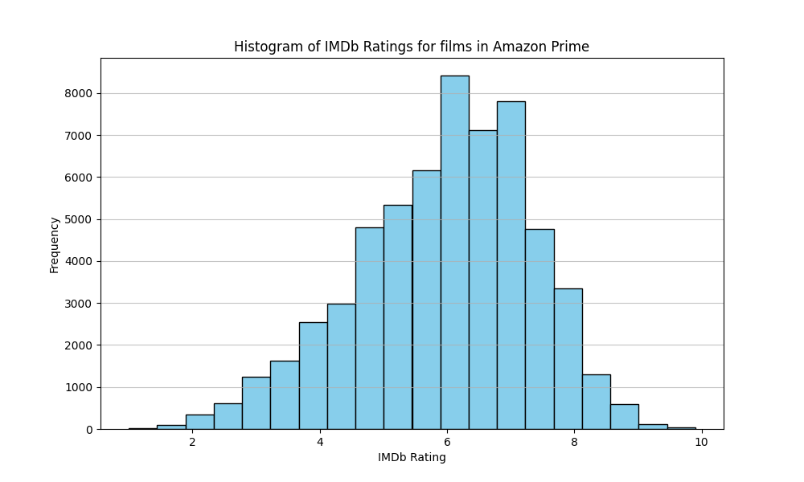
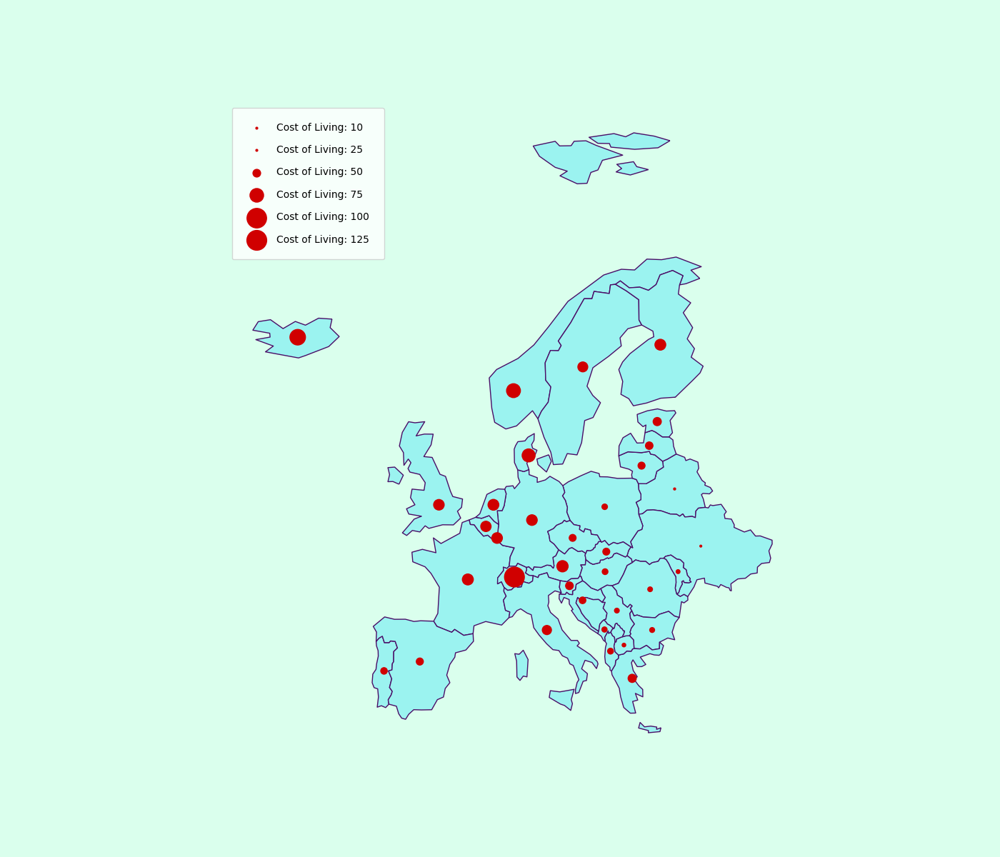
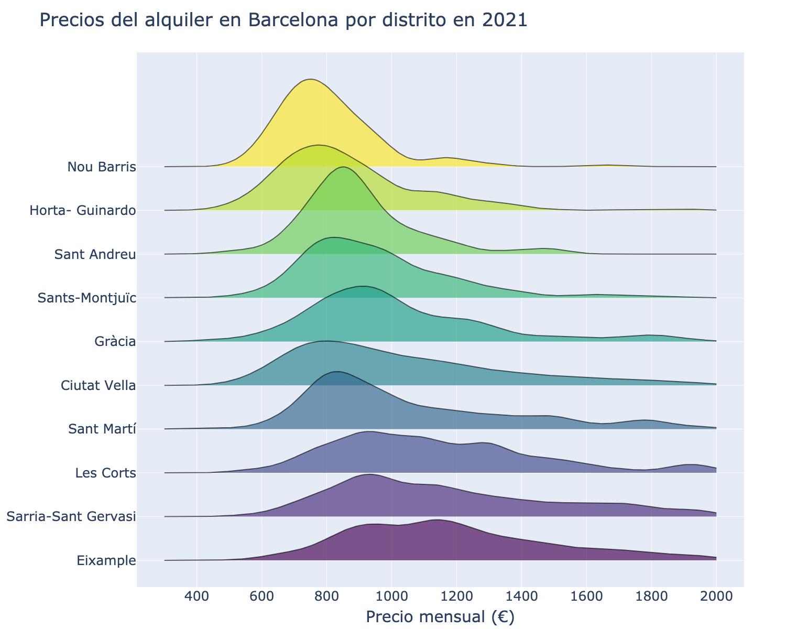

# Visualización de Datos. PEC 2

Repositorio para la PEC 2 de la asignatura Visualización de Datos, del máster universitario en Ciencia de Datos de la UOC.

## Contenidos

- [Introducción](#introducción)
- [Visualizaciones](#visualizaciones)
- [Referencias](#referencias)

## Introducción

Este repositorio contiene las siguientes visualizaciones, así cómo el código para generarlas y los datasets utilizados:

- Ridgeline Chart
- Proportional Symbols Map
- Histogram

## Visualizaciones

Las siguientes visualizaciones han sido realizadas en Python. El código utilizado se encuentra en este mismo repositorio.

### Puntuación en IMDb de las películas presentes en Amazon Prime

Este histograma muestra la distribución de la puntuación en IMDb para las películas disponibles en Amazon Prime. Permite entender cómo se distribuyen las puntuaciones y apreciar la calidad y diversidad de las películas ofrecidas por esta plataforma.

* **Dataset**: [Amazon Prime Dataset](https://www.kaggle.com/datasets/octopusteam/full-amazon-prime-dataset)

### Índice de coste de vida en Europa

Esta visualización es un mapa de símbolos proporcionales que representa el Índice de Coste de Vida por país en Europa. El tamaño variable de los símbolos indica las diferencias en el coste de vida entre países, permitiendo identificar fácilmente aquellos con mayor y menor coste de vida, así como facilitar comparaciones.

* **Dataset**: [Cost of Living Index Dataset](https://www.kaggle.com/datasets/myrios/cost-of-living-index-by-country-by-number-2024)

### Distribución del precio del alquiler por distrito en Barcelona (2021)

Esta visualización es un Ridgeline Chart que muestra la distribución del precio de los alquileres a través de diferentes distritos en Barcelona durante el año 2021. Permite realizar comparaciones entre distritos de forma sencilla.

* **Dataset**: [Barcelona Housing Prices](https://www.kaggle.com/datasets/imanollaconcha/barcelona-fotocasa-housingprices)

## Referencias

- Python [Python.org](https://www.python.org/)
- Matplotlib - [Documentación](https://matplotlib.org/stable/contents.html)
- Pandas - [Documentación](https://pandas.pydata.org/)
- Numpy - [Documentación](https://numpy.org/doc/stable/user/index.html#user/)
- Ridgeplot - [Documentación](https://ridgeplot.readthedocs.io/en/stable/)

Es necesario tener instaladas las librerias especificadas en el archivo requirements.txt para utilizar este código.
